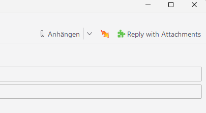

# Reply with Attachments

##  [Zur deutschen Version](README_DE.md)

**Reply with Attachments** is a Thunderbird add‑on that automatically includes the original attachments when you reply.

---

## Quick Links

- English Docs: https://bitranox.github.io/Thunderbird-Reply-with-Attachments/en/
- Deutsche Doku: https://bitranox.github.io/Thunderbird-Reply-with-Attachments/de/
- All languages: see README_LANGUAGES.md

## Support This Project

If you like this add‑on, please consider supporting it:

## Features

- Automatically attaches files from the original email when replying.
- Configurable behavior: attachments can be
  - added automatically, or
  - added only after confirmation (a small, accessible dialog). In Options you
    can enable the confirmation and choose the default answer (Yes/No).
- Blacklist of filenames (glob patterns) prevents specific files from being
  attached automatically. Examples: `*.png`, `smime.*`, `*.p7s`.
  Matching is case‑insensitive and checks the filename only; provide one pattern
  per line in Options.
- Adds originals even if you already attached something yourself; avoids duplicates by filename.
- Skips SMIME certificates and inline images to avoid unnecessary attachments.

Screenshot demonstrating the add-on in action:

---

## Configuration

Open the add‑on’s Options page:

- Thunderbird → Tools → Add‑ons and Themes → find “Reply with Attachments” → Preferences/Options

Available settings:

- Confirmation: toggle “Ask before adding attachments”.
  - Default Answer: choose “Yes” or “No” for the dialog’s default focus.
  - Keyboard shortcuts in the dialog: Y or J = Yes, N or Esc = No; Tab/Shift+Tab and Arrow keys cycle focus.
- Blacklist (glob patterns): one pattern per line, case‑insensitive, matched against filenames only.
  - Examples: `*.png`, `smime.*`, `*.p7s`
  - Useful to suppress image/logo files or signature files from being added.

Tip: Defaults are prefilled on first use. You can reset to defaults any time.

---

For detailed Install/Options/Permissions, see Docs above.

---

## Usage (short)
- Reply and the add‑on adds originals automatically — or asks first, if enabled in Options.
- De‑duplicated by filename; SMIME and inline images are always skipped.

---

## Behavior Details

- Duplicate prevention: The add-on marks the compose tab as processed using a per‑tab session value and an in‑memory guard. It won’t add originals twice.
- Respect existing attachments: If the compose already contains some attachments, originals are still added exactly once, skipping filenames that already exist.
- Exclusions: SMIME artifacts (e.g. `smime.p7s`, `application/pkcs7-signature`/`x-pkcs7-signature`/`pkcs7-mime`) and inline images are ignored. If nothing qualifies on the first pass, a relaxed fallback re-checks non‑SMIME parts.

---

## Debug Logging

Verbose debug logs can be toggled at runtime (errors and warnings are always shown):

1. Open Thunderbird’s Error Console: Tools → Developer Tools → Error Console.
2. Execute to enable: `messenger.storage.local.set({ debug: true })`
3. Execute to disable: `messenger.storage.local.set({ debug: false })`
4. Logs appear in the Error Console while composing or sending replies.

---

## Compatibility

- **Tested with Thunderbird Nebula 128.6.0esr (64-Bit).**
- **Older Thunderbird versions are not supported.**

---

## Troubleshooting

- If the add-on does not work as expected, ensure that you are using a compatible version of Thunderbird (128.6.0esr or later).
- Check the Thunderbird error console (**Tools > Developer Tools > Error Console**) for any issues related to the add-on.

---

## Contributing

If you'd like to contribute to this project:
1. Fork the repository.
2. Create a feature branch (`git checkout -b feature-name`).
3. Commit your changes (`git commit -m "Add feature name"`).
4. Push to your branch (`git push origin feature-name`).
5. Open a pull request.

---

## Development

- Build add-on ZIPs: `make pack`
- Run tests (Vitest): `make test`
- Discover commands: `make help`

## Permissions

This add-on requests a minimal set of permissions required to provide its functionality. Rationale per permission:

- `compose`: read composer state, list existing attachments, add attachments, and listen to compose events.
- `messagesRead`: read message metadata to discover original attachments and fetch their files.
- `messagesModify`: currently present in the manifest; not actively used to mutate messages. Planned: audit and remove if redundant.
- `windows`: open a small popup window as a last‑resort confirmation UI when the in‑document confirmation isn’t available.

Other APIs used without explicit permissions in Thunderbird contexts:

- `storage`: persist options and small runtime flags.
- `sessions`: track a per‑tab idempotency marker and clear it on tab close.
- `tabs`: open GitHub/Donate links from the options page (extension page context).
- `scripting.compose`: preregister and inject the confirmation content script into compose documents (MV3).

### Testing & Coverage
- `make test` runs the full Vitest suite. If the optional coverage plugin is installed, it also produces coverage reports.
- To enable coverage locally:
  1) `npm i -D @vitest/coverage-v8`
  2) run `make test` again
  3) See console summary and open `coverage/index.html` for the HTML report
- In CI or restricted environments where the plugin can’t be installed, `make test` automatically falls back to running tests without coverage.

#### i18n Checks Only
- Quick locale audit: `make test-i18n` runs only parity/placeholder/title tests for translations.

Packaged files are created as `reply-with-attachments-plugin*.zip` in the repository root. For manual testing in Thunderbird, use Tools → Add-ons and Themes → gear menu → Install Add-on From File… and select the built ZIP.

---

## Support This Project

If you like this add-on, consider supporting its development with a small contribution:

---

## License

This project is licensed under the GNU General Public License v3.  
You can view the full license text [here](https://github.com/bitranox/Thunderbird-Reply-with-Attachments/blob/master/LICENCE).

---

## Acknowledgments

Special thanks to the Thunderbird add-on developer community for their excellent documentation and support.

---

## Version History / Changelog

### V1.0.1
- Replaced the custom `getAttachmentsFromMessage()` function, which manually traversed MIME parts to find attachments, with the standard method `browser.messages.listAttachments()`.

### V1.0.0
- Initial release.
